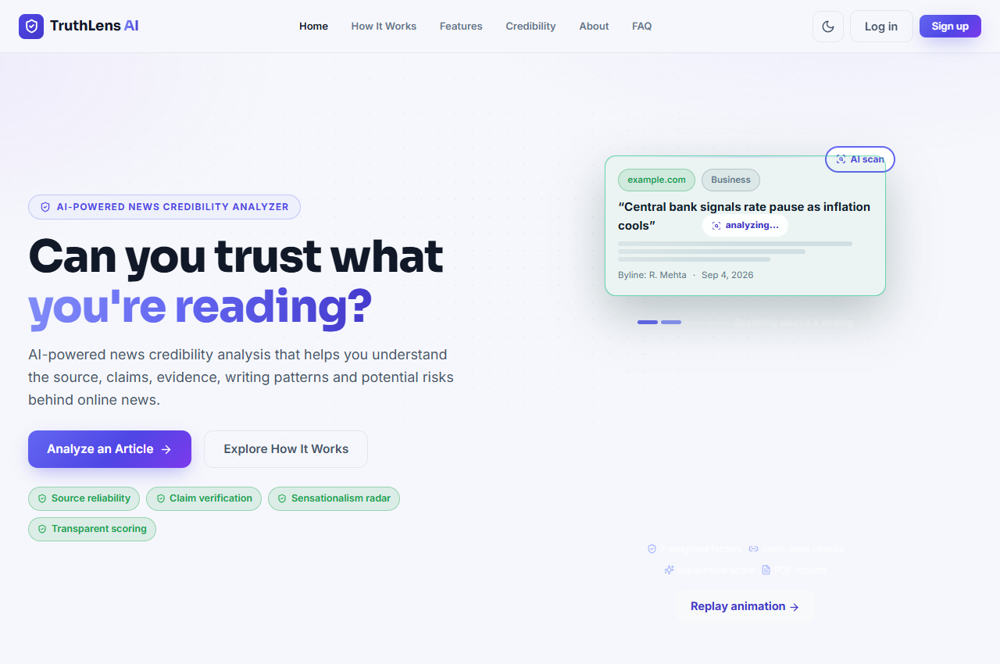
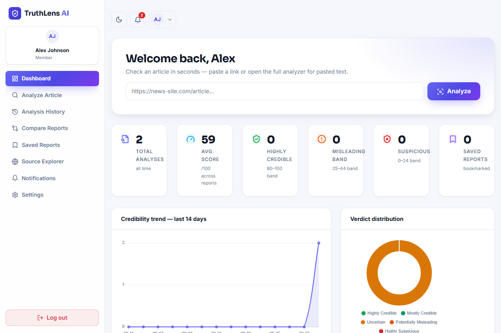
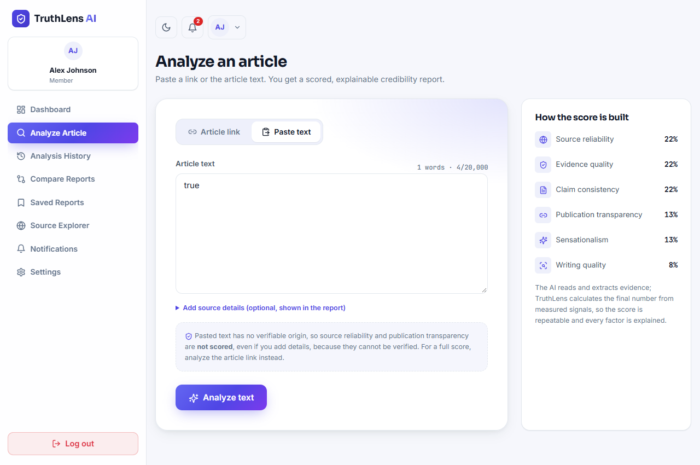
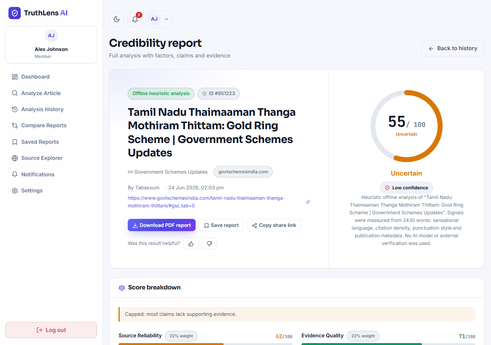
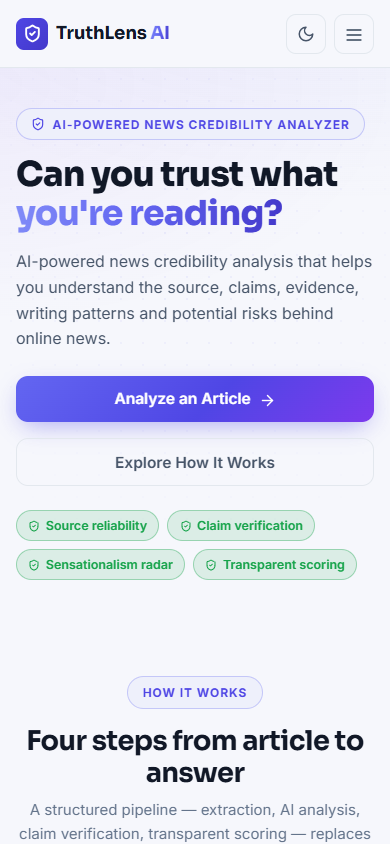
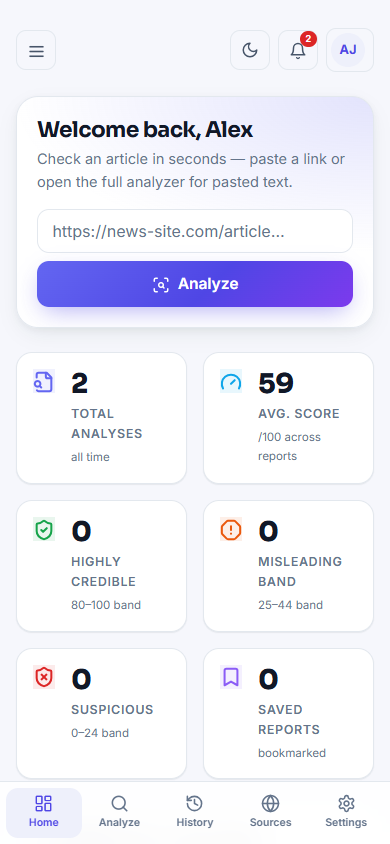
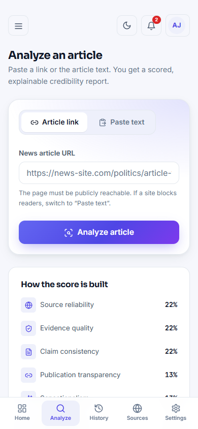
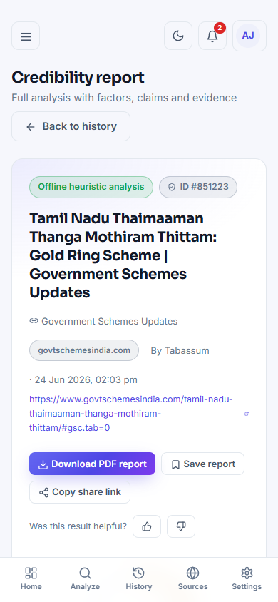
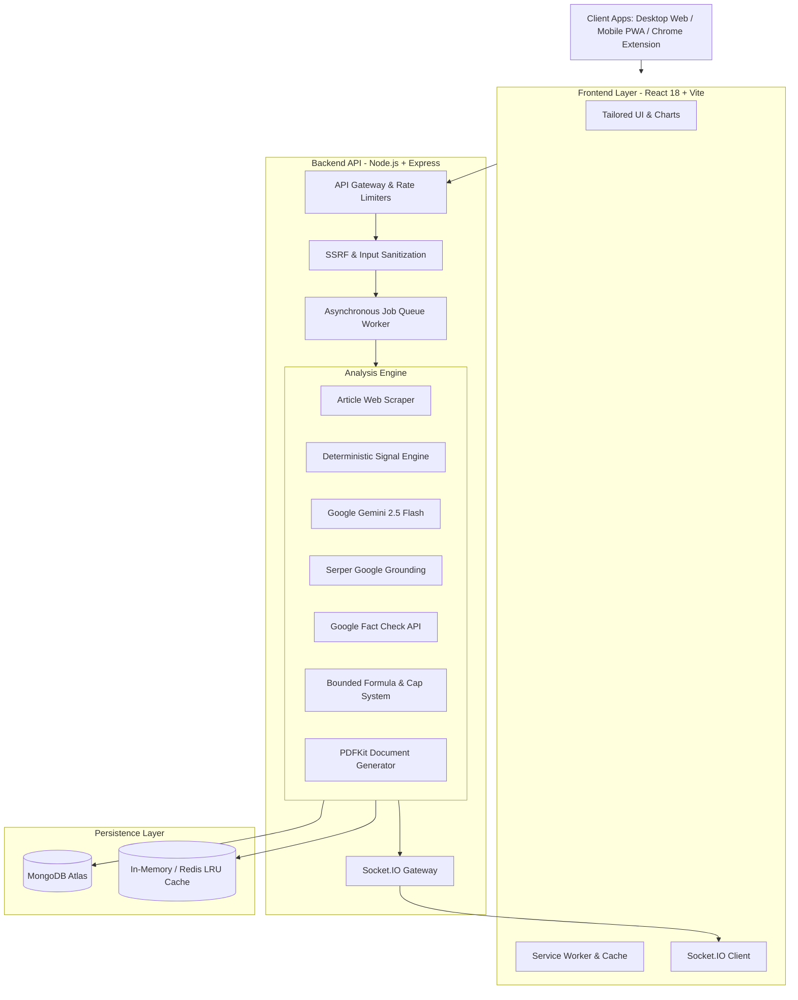

# TruthLens AI

<div align="center">

[](LICENSE)
[](https://nodejs.org)
[](https://react.dev)
[](https://vitejs.dev)
[](https://www.mongodb.com)
[](https://ai.google.dev)
[](#progressive-web-app-pwa)

### *Analyze. Verify. Understand the Truth.*

**An intelligent, explainable news credibility analysis platform combining LLM evidence extraction, live fact-check verification, and deterministic signal modeling.**

[Explore Features](#key-features) • [Screenshots](#visual-showcase) • [Architecture](#system-architecture) • [Scoring Model](#credibility-scoring-methodology) • [Quickstart](#getting-started) • [API Reference](#api-reference)

---

</div>

## Overview

**TruthLens AI** is an enterprise-grade full-stack credibility intelligence platform that evaluates news articles, digital publications, and unverified claims. Rather than making black-box assertions of "true" or "false", TruthLens synthesizes multi-dimensional signals—such as publisher transparency, linguistic sensationalism, citation rigor, and cross-source corroboration—into a **bounded, explainable score (0–100)** accompanied by plain-language findings, strengths, and risk indicators.

The platform is accessible across all devices via a modern **Progressive Web App (PWA)**, a dedicated **Chrome Browser Extension**, and an administrative moderation panel.

---

## Visual Showcase

### Desktop Experience
<table>
  <tr>
    <td width="50%">
      <h4 align="center">Landing & Analyzer Hero</h4>
      
    </td>
    <td width="50%">
      <h4 align="center">Interactive User Dashboard</h4>
      
    </td>
  </tr>
  <tr>
    <td width="50%">
      <h4 align="center">Real-Time Analysis Engine</h4>
      
    </td>
    <td width="50%">
      <h4 align="center">Comprehensive Credibility Report</h4>
      
    </td>
  </tr>
</table>

### Mobile Progressive Web App (PWA)
<table>
  <tr>
    <td width="25%">
      <h4 align="center">Mobile Landing</h4>
      
    </td>
    <td width="25%">
      <h4 align="center">Mobile Dashboard</h4>
      
    </td>
    <td width="25%">
      <h4 align="center">Mobile Analyzer</h4>
      
    </td>
    <td width="25%">
      <h4 align="center">Mobile Report</h4>
      
    </td>
  </tr>
</table>

---

## Key Features

- **Multi-Input Analysis**: Analyze news directly by live URL (automated web scraper with SSRF protection) or by raw text paste (with intelligent word-count and formatting normalization).
- **Asynchronous Processing Pipeline**: Long-running AI and web-verification tasks are executed via non-blocking background jobs with real-time Socket.io progress streaming.
- **Bounded AI + Heuristic Fallback**: AI outputs (Gemini 2.5 Flash) extract factual claims, logical contradictions, and quotes, but are bounded by deterministic baseline rules to prevent LLM hallucinations. Transparent offline heuristic mode ensures 100% availability without API keys.
- **Live Search Grounding & Fact Checks**: Cross-references top claims against Google Serper and Google Fact Check Tools API to detect existing debunks and consensus.
- **Side-by-Side Article Comparison**: `/user/compare` allows side-by-side analysis of two articles to compare tone, evidence quality, and conflicting claims.
- **Branded PDF Export**: Generates professional credibility report PDFs on the fly for archiving or legal presentation.
- **Shareable Reports**: Generate secure, signed share links (`/shared/:token`) with full public read-only access.
- **Domain & Source Registry**: Community-driven directory of publishers with historical credibility records and domain trust levels.
- **Progressive Web App (PWA)**: Installable on iOS, Android, and Desktop with offline caching, service workers, and mobile bottom navigation.
- **Manifest V3 Chrome Extension**: Right-click any highlighted text or link on the web to pre-fill and verify directly inside TruthLens.
- **Enterprise Admin Suite**: Role-based access control (RBAC), user moderation, source reputation management, audit logs, and analytics.

---

## System Architecture



---

## Credibility Scoring Methodology

The final score is owned by a transparent, deterministic algorithm. AI models extract claims and linguistic nuances, but cannot arbitrarily set the final grade.

### Factor Weight Matrix

| Evaluation Factor | Weight | Evaluation Criteria |
| :--- | :---: | :--- |
| **Source Reliability** | **22%** | Domain reputation, independent news registry records, corporate ownership transparency. |
| **Evidence Quality** | **22%** | Density of cited studies, official records, primary datasets, and named expert quotes. |
| **Claim Consistency** | **22%** | Absence of internal contradictions; verifiable alignment between headline and article body. |
| **Publication Transparency** | **13%** | Clear disclosure of author identity, editorial contact, corrections policy, and timestamp. |
| **Sensationalism Radar** | **13%** | Detection of clickbait headlines, emotional manipulation, urgency triggers, and alarmist rhetoric. |
| **Writing Quality** | **8%** | Journalistic neutrality, grammatical structure, logical objectivity, and balanced perspective. |

### Dynamic Safety Caps & Normalization

- **Unscored Exclusion**: Factors that cannot be verified (e.g., source reliability for pasted text without a known URL) are excluded, and remaining weights are proportionally renormalized.
- **Contradiction Caps**: A single contradicted critical claim strictly caps the overall score at **44/100**. Multiple contradictions cap the score at **50/100**.
- **High-Risk Publisher Cap**: Outlets categorized as "High Risk" in the source registry cannot score above **48/100**.
- **Confidence Rating**: High, Medium, or Low confidence is derived from the completeness of measured factors and external search coverage.

| Verdict Label | Numeric Range | Interpretation |
| :--- | :---: | :--- |
| **Highly Credible** | `80 – 100` | Reliable sourcing, verifiable citations, balanced neutral tone. |
| **Mostly Credible** | `65 – 79` | Minor gaps in sourcing, but largely corroborated and factual. |
| **Uncertain** | `45 – 64` | Mixed evidence, missing primary data, or partial corroboration. |
| **Potentially Misleading** | `25 – 44` | High sensationalism, unsupported claims, or notable red flags. |
| **Highly Suspicious** | `0 – 24` | Multiple contradictions, deceptive intent, or blacklisted source. |

---

## Tech Stack

| Domain | Technologies |
| :--- | :--- |
| **Frontend** | React 18, Vite 5, React Router 6, Framer Motion, Chart.js, Bootstrap 5, Lucide Icons, html2canvas, DOMPurify |
| **Backend** | Node.js, Express.js 4, Socket.IO, Mongoose 8, Axios, Cheerio, PDFKit, Nodemailer, Bcrypt.js, Helmet, Express-Rate-Limit |
| **AI & Grounding** | Google Gemini 2.5 Flash (`@google/genai`), Serper.dev Google Search API, Google Fact Check Tools API |
| **Database & Cache** | MongoDB Atlas, In-Memory LRU Cache, Redis (ioredis) |
| **DevOps & PWA** | Service Workers, Manifest V3 Extension, Docker, Docker Compose, GitHub Actions CI |

---

## Getting Started

### Prerequisites

- **Node.js**: v18.0.0 or higher
- **npm**: v9.0.0 or higher
- **MongoDB**: Local MongoDB instance or free [MongoDB Atlas](https://www.mongodb.com/atlas) cluster connection string.

---

### Installation

1. **Clone the repository**:
   ```bash
   git clone https://github.com/SanjayGoffl/TruthLens.git
   cd TruthLens
   ```

2. **Configure Environment Variables**:
   Create a `.env` file in the `backend/` folder:
   ```bash
   cp backend/.env.example backend/.env
   ```
   Configure your settings:
   ```env
   NODE_ENV=development
   PORT=5000
   FRONTEND_URL=http://localhost:5173
   BACKEND_URL=http://localhost:5000

   # Database
   MONGO_URI=mongodb+srv://<username>:<password>@cluster.mongodb.net/truthlens

   # Security & Auth
   JWT_SECRET=your_super_secret_key_at_least_32_characters_long
   ADMIN_NAME=Administrator
   ADMIN_EMAIL=admin@truthlens.ai
   ADMIN_PASSWORD=your_strong_admin_password_min_6_chars

   # AI & Fact Checking (Optional - Fallback active if omitted)
   GEMINI_API_KEY=your_gemini_api_key_here
   GEMINI_MODEL=gemini-2.5-flash
   SERPER_API_KEY=your_serper_api_key_here
   FACTCHECK_API_KEY=your_google_factcheck_key_here

   # Mail (Optional - logs OTP to console in development)
   MAIL_HOST=smtp.gmail.com
   MAIL_PORT=587
   MAIL_USERNAME=your_gmail@gmail.com
   MAIL_PASSWORD=your_gmail_app_password
   ```

3. **Install Dependencies**:
   ```bash
   # Install backend dependencies
   cd backend
   npm install

   # Install frontend dependencies
   cd ../frontend
   npm install
   ```

---

### Running the Application

1. **Start Backend**:
   ```bash
   cd backend
   npm start
   # API listening on http://localhost:5000
   ```

2. **Start Frontend**:
   ```bash
   cd frontend
   npm run dev
   # Vite App listening on http://localhost:5173
   ```

3. Open **`http://localhost:5173`** in your browser.

---

## Docker Deployment

Run the complete multi-container setup with one command:

```bash
docker-compose up --build -d
```

Services initialized:
- `backend`: Node API on port `5000`
- `frontend`: Nginx PWA on port `80`
- `redis`: High-speed cache on port `6379`
- `mongodb`: Database on port `27017`

---

## Progressive Web App (PWA)

TruthLens is a fully compliant PWA. To install:
- **Chrome / Edge (Desktop)**: Click the **Install TruthLens AI** icon in the browser address bar.
- **iOS Safari**: Tap **Share** $\rightarrow$ **Add to Home Screen**.
- **Android Chrome**: Tap the banner prompt **"Add TruthLens to Home Screen"**.

---

## Browser Extension (Chrome)

1. Open Chrome and navigate to `chrome://extensions/`.
2. Toggle on **Developer mode** (top-right).
3. Click **Load unpacked** and select the [`extension/`](extension/) directory from this repository.
4. Highlight any text or right-click any link on the web and select **"Analyze with TruthLens"**.

---

## API Reference

| Method | Endpoint | Description | Auth Required |
| :--- | :--- | :--- | :---: |
| `POST` | `/api/auth/register` | Register a new user | No |
| `POST` | `/api/auth/login` | Sign in & receive JWT / OTP challenge | No |
| `POST` | `/api/auth/verify-otp` | Verify 2FA / Login OTP code | No |
| `POST` | `/api/analysis/jobs` | Queue a background analysis job (URL or text) | Yes |
| `GET` | `/api/analysis/jobs/:jobId` | Poll background job status and progress | Yes |
| `GET` | `/api/analysis/:id` | Retrieve full credibility report | Yes |
| `GET` | `/api/analysis/history` | List authenticated user's analysis history | Yes |
| `GET` | `/api/report/:id` | Download generated PDF report | Yes |
| `POST` | `/api/analysis/:id/share` | Enable public sharing for a report | Yes |
| `GET` | `/api/sources` | Browse known news publishers and trust ratings | No |
| `GET` | `/api/health` | Service health status & cache backend | No |

---

## Automated Testing

```bash
cd backend
npm test
```

Runs comprehensive tests covering:
- Deterministic heuristic signal extraction
- Weight calculation and cap enforcement
- SSRF prevention & URL sanitization
- HTML sanitization and claim parsing
- In-memory cache fallbacks

---

## Author

* **Sanjay G** ([@SanjayGoffl](https://github.com/SanjayGoffl))

---

## License

This project is licensed under the MIT License - see the [LICENSE](LICENSE) file for details.
